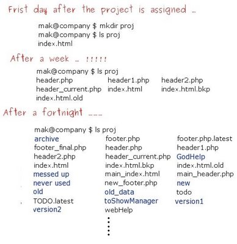
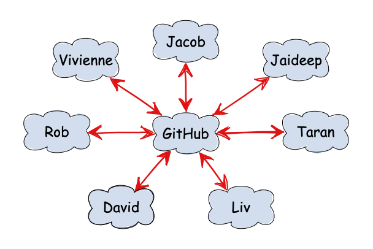
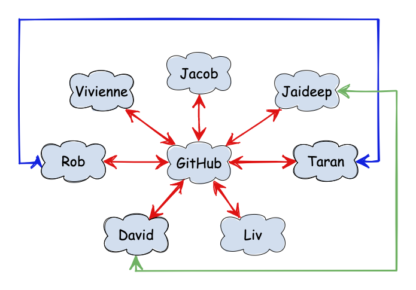
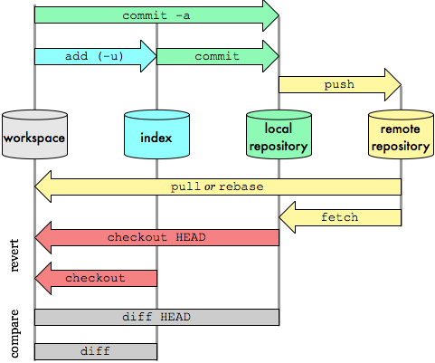
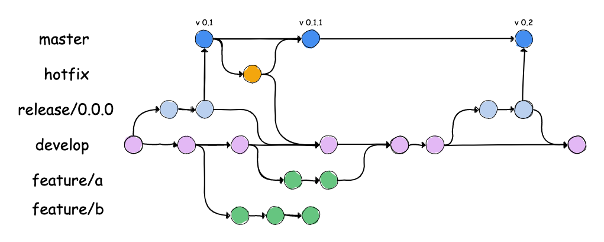

---
jupytext:
  text_representation:
    extension: .md
    format_name: myst
    format_version: 0.13
    jupytext_version: 1.13.8
kernelspec:
  display_name: Bash
  language: bash
  name: bash
---

<!-- markdownlint-disable MD024 MD041 - repeated headings and not header first-->

+++ {"slideshow": {"slide_type": "slide"}, "tags": []}

# Git and GitFlow

David Orme

+++ {"slideshow": {"slide_type": "slide"}, "tags": []}

## Workshop format

- Tricky to do worked examples in `git`
- Do ask questions!
- Slides are online:

<!-- markdownlint-disable-next-line MD013-->

[](https://github.com/ImperialCollegeLondon/virtual_rainforest/blob/main/source/development/training/git.ipynb)

+++ {"slideshow": {"slide_type": "subslide"}, "tags": []}

## Other sources of help

- The
  [Multilingual Quantitative Biologist](https://mhasoba.github.io/TheMulQuaBio/notebooks/03-Git.html)
  introduction to Git.
- Reference book: <http://git-scm.com/book>
- Tutorials: <https://try.github.io>

+++ {"slideshow": {"slide_type": "subslide"}, "tags": []}

## Tools

- `git` is the **software**
- GitHub is a server system providing **`git`**
- `git` is a **command line application**
- Some programs provide a **graphical user interface**
  - [Visual Studio Code](https://code.visualstudio.com/)
  - [Github Desktop](https://desktop.github.com/)
  - [PyCharm](https://www.jetbrains.com/pycharm/)

+++ {"slideshow": {"slide_type": "slide"}, "tags": []}

## Version Control

- Version control tracks changes to **text files** automatically.
- Often computer code but can be data files etc.
- A **repository** is a directory containing files under version control.
- All changes to files are archived and can be recalled.
- Provide **repository branches** for code development.

+++ {"slideshow": {"slide_type": "subslide"}, "tags": []}

## Why Version Control?

- Roll back changes to code and other data
- A remote backup of a code project
- Organise code cleanly
- Collaborate with others on developing new code
- Distribute new code to collaborators

+++ {"slideshow": {"slide_type": "subslide"}, "tags": []}

## Why Version Control?



<!-- http://maktoons.blogspot.com/2009/06/if-dont-use-version-control-system.htm -->

+++ {"slideshow": {"slide_type": "slide"}, "tags": []}

## Local vs remote

- A project can exist as a single **local** repository
- But local repos can be synchronised with one (or more!) **remote** repositories



+++ {"slideshow": {"slide_type": "subslide"}, "tags": []}

## Decentralised

- A local repository **can** have other **remote** repositories.



+++ {"slideshow": {"slide_type": "subslide"}, "tags": []}

## Fork vs Clone

- Using `git clone` creates a copy with the cloned repo as a **remote**
- **Forking**
  - copying a project into a new repo,
  - with a new owner,
  - usually to develop it in a different direction.
  - There is no `git fork` command line option.

+++ {"slideshow": {"slide_type": "slide"}, "tags": []}

## Using `git`

| Command             | What it does                                   |
| :------------------ | :--------------------------------------------- |
| `git init`          | Initialize a new repository                    |
| `git clone`         | Download a repository from a remote            |
| `git status`        | Show the current status of a branch            |
| `git diff`          | Show differences between commits               |
| `git blame`         | See who changed a file                         |
| `git log`           | Show commit history                            |
| `git commit`        | Commit changes to current branch               |
| `git branch`        | Show branches                                  |
| `git branch name`   | Create new branch                              |
| `git checkout name` | Switch to a different code state (e.g. branch) |
| `git fetch`         | Get remote changes without merging             |
| `git merge`         | Merge versions of files                        |
| `git pull`          | Synchronise code state to remote               |
| `git push`          | Send committed changes to remote               |

+++ {"slideshow": {"slide_type": "subslide"}, "tags": []}

## Using `git`


<!-- https://xkcd.com/1597/ -->

+++ {"slideshow": {"slide_type": "subslide"}, "tags": []}

## Making changes to a repo



<!-- https://blog.osteele.com/2008/05/my-git-workflow/ -->

+++ {"slideshow": {"slide_type": "subslide"}, "tags": []}

## Use `git status` **constantly**

```bash
On branch feature/isotopic_discrimination
Your branch is ahead of 'origin/feature/isotopic_discrimination' by 3 commits.
  (use "git push" to publish your local commits)

Changes not staged for commit:
  (use "git add <file>..." to update what will be committed)
  (use "git restore <file>..." to discard changes in working directory)
    modified:   pyrealm/pmodel.py

Untracked files:
  (use "git add <file>..." to include in what will be committed)
    .pylintrc
    old_untidyfile.xlsx
```

+++ {"slideshow": {"slide_type": "subslide"}, "tags": []}

## Using `add` and `commit`

- `git add` makes git start tracking a file
- `git commit`:
  - adds changes to the local repository
  - requires a message explaining the changes
  - each commit has a unique reference id
  - `f960d034cb57dd277af7501be6884f767e` or `f960d03`
- You should:
  - commit **frequent, small changes**
  - with **meaningful, clear messages**

+++ {"slideshow": {"slide_type": "subslide"}, "tags": []}

## Using `add` and `commit`


<!-- https://xkcd.com/1296/ -->

+++ {"slideshow": {"slide_type": "subslide"}, "tags": []}

## Using `push`, `fetch` and `pull`

- Share code with others (`push`)
- Find out about new code from others (`fetch`)
- Integrate new code (`pull`)
- Find out what has changed:

```bash
git remote update
git status
```

+++ {"slideshow": {"slide_type": "subslide"}, "tags": []}

## Ignoring Files

- Not all files in a repository should be tracked
  - Created files - logs, compiled code
  - Files that do not `git` well
- Use `.gitignore` files to set what is ignored.
  - `./.gitignore`
  - `./specific/subdirectory/.gitignore`
  - `~/.gitignore_global`
- The `.gitignore` files are **part of the repository**

+++ {"slideshow": {"slide_type": "subslide"}, "tags": []}

## Using `.gitignore` patterns

| Pattern    | gitignore result                                                    |
| :--------- | :------------------------------------------------------------------ |
| `#comment` | This is a comment                                                   |
| `target`   | Ignore files/dirs called `target` everywhere                        |
| `target/`  | Ignore dirs (trailing `/`) named `target` everywhere                |
| `/target`  | Ignore files/dirs called `target` in the project root (leading `/`) |
| `/target/` | Ignore dirs called `target` in the project root                     |
| `*.ext`    | Ignore anything with the extension `.ext`                           |
| `*.py[co]` | Ignore anything ending in `.pyc` or `.pyo`                          |

+++ {"slideshow": {"slide_type": "subslide"}, "tags": []}

## Removing and moving files

- `git rm <file>`
  - removes a file from the index **and deletes it**
- `git rm --cached <file>`
  - removes a file from the index but **leaves the file**
  - could be added to `.gitignore`
- `git mv <file> <new location>`
  - file is moved
  - changes are tracked across locations

+++ {"slideshow": {"slide_type": "subslide"}, "tags": []}

## What does not `git` well?

- `git` tracks **incremental changes**:

  - Every change recorded in the index...
  - ... but as small `diff` changes.
  - Keeps the repository size small:
  - `git count-objects -vH`

- **Binary files**

  - Incremental diffs rarely possible
  - Whole file is stored for every change

- **Large, frequently changing files**

  - Very large `diff` details

+++ {"slideshow": {"slide_type": "subslide"}, "tags": []}

## Binary and large files

- Keep to small, static files as much as possible
  - Images
  - Small data files for testing
  - Minimum working example (MWE) data for documentation
- If needed, use extensions to point to larger binary files:
  - [`git-annex`](https://git-annex.branchable.com)
  - [`git-lfs`](https://www.atlassian.com/git/tutorials/git-lfs)

+++ {"slideshow": {"slide_type": "slide"}, "tags": []}

## What does it look like?

````bash
dorme@MacBook-Pro tmp % git clone https://URLofremote/git/repo
dorme@MacBook-Pro tmp % touch my_new_code_file.py
dorme@MacBook-Pro local % git status
On branch master
Your branch is up to date with 'origin/master'.

Untracked files:
  (use "git add <file>..." to include in what will be committed)
        my_new_code_file.py

nothing added to commit but untracked files present (use "git add" to track)
dorme@MacBook-Pro local % ```

+++ {"slideshow": {"slide_type": "subslide"}, "tags": []}

## What does it look like?

```bash
dorme@MacBook-Pro local % git add my_new_code_file.py
dorme@MacBook-Pro local % git status
On branch master
Your branch is up to date with 'origin/master'.

Changes to be committed:
  (use "git restore --staged <file>..." to unstage)
        new file:   my_new_code_file.py

dorme@MacBook-Pro local %
````

+++ {"slideshow": {"slide_type": "subslide"}, "tags": []}

## What does it look like?

```bash
dorme@MacBook-Pro local % git commit -m "My first code contribution"
[master 71d1de7] My first code contribution
 1 file changed, 0 insertions(+), 0 deletions(-)
 create mode 100644 my_new_code_file.py
dorme@MacBook-Pro local % git status
On branch master
Your branch is ahead of 'origin/master' by 1 commit.
  (use "git push" to publish your local commits)

nothing to commit, working tree clean
dorme@MacBook-Pro local % 
```

+++ {"slideshow": {"slide_type": "subslide"}, "tags": []}

## What does it look like?

```bash
dorme@MacBook-Pro local % git push
Enumerating objects: 3, done.
Counting objects: 100% (3/3), done.
Delta compression using up to 10 threads
Compressing objects: 100% (2/2), done.
Writing objects: 100% (2/2), 265 bytes | 265.00 KiB/s, done.
Total 2 (delta 0), reused 0 (delta 0), pack-reused 0
To /Users/dorme/gittest/remote/.git
   480ebe8..71d1de7  master -> master
dorme@MacBook-Pro local % git status
On branch master
Your branch is up to date with 'origin/master'.

nothing to commit, working tree clean
dorme@MacBook-Pro local % 
```

+++ {"slideshow": {"slide_type": "slide"}, "tags": []}

## Branching

- Repositories can contain **branches**
- A branch tracks an alternative parallel sets of changes
- Can contain changes to code
- Can contain completely different content (e.g. `gh-pages`)



+++ {"slideshow": {"slide_type": "subslide"}, "tags": []}

## Git `checkout`

- Move between branches
- Move between commits

```bash
git checkout feature/a
git checkout f960d03
```

+++ {"slideshow": {"slide_type": "subslide"}, "tags": []}

## Merging

- Incorporating changes into a branch
  - Merging another branch
  - Merging a **pull request**
- Different
  **[strategies](https://docs.github.com/en/repositories/configuring-branches-and-merges-in-your-repository/configuring-pull-request-merges/about-merge-methods-on-github)**
  (merge/squash/rebase)
- Applies the changes in the request or branch to the branch

+++ {"slideshow": {"slide_type": "subslide"}, "tags": []}

## Merge conflicts

- Automatic resolution:
  - Changes to different files
  - Changes to different lines
- Merge **conflicts**:
  - Same lines edited
  - Same removed or added
  - Manual **resolution**: what is the **intended final state**
  - Files marked up with conflict markers

```text
<<<<<<< HEAD
x = np.random.random(40)
=======
x = np.random.randint(40, 0, 100)
>>>>>>> feature/better_random
```

+++ {"slideshow": {"slide_type": "subslide"}, "tags": []}

## The `git reset` command

- Allows a **local** repository to step back
  - `--soft`: undo commits
  - `--hard`: discards changes (dangerous!)
- Once commits have been pushed:
  - Changes are now in other clones
  - **Much** harder to correct errors

+++ {"slideshow": {"slide_type": "slide"}, "tags": []}

## The `pre-commit` extension

- An framework to [manage pre-commit hooks](https://pre-commit.com)
- [Git **hooks**](https://git-scm.com/book/en/v2/Customizing-Git-Git-Hooks) are
  instructions to run code when events happen.
- The `pre-commit` hook:
  - is triggered by `git commit` but...
  - ...runs **before** the commit happens.
- Typically used to run code checking before commit.
- Code **must pass** the checking or the commit is aborted.

+++ {"slideshow": {"slide_type": "subslide"}, "tags": []}

## The `pre-commit` extension

- Adds a set of checking messages to commit outputs

```bash
pyrealm % git commit -m "Catching missed hook issues"
check for merge conflicts..............................Passed
debug statements (python)..............................Passed
isort..................................................Passed
black..................................................Passed
flake8.................................................Passed
[develop e35b55e] Catching missed hook issues
 4 files changed, 80 insertions(+), 67 deletions(-)
```

+++ {"slideshow": {"slide_type": "slide"}, "tags": []}

## Git Flow strategy

- A
  [branching strategy for development using Git](https://nvie.com/posts/a-successful-git-branching-model/)
- Not the only strategy and has been criticized!
- Two core branches:
  - production (often `main`)
  - develop
- Other branches as needed:
  - release
  - hotfix
  - feature

+++ {"slideshow": {"slide_type": "subslide"}, "tags": []}

## Git Flow implementation

- More than one implementation of the Git Flow strategy
- Provide yet another set of commands
- Combinations of
  [basic `git` commands](https://gist.github.com/JamesMGreene/cdd0ac49f90c987e45ac)
- I have been using
  [the `gitflow-avh` implementation](https://github.com/petervanderdoes/gitflow-avh)

+++ {"slideshow": {"slide_type": "subslide"}, "tags": []}

## Git Flow branches


+++ {"slideshow": {"slide_type": "subslide"}, "tags": []}

## Git flow init

A more complex `init` process that sets branch names.

```text
dorme@MacBook-Pro tmp % git flow init
Initialized empty Git repository in /Users/dorme/Research/REALM/tmp/.git/
No branches exist yet. Base branches must be created now.
Branch name for production releases: [master] main
Branch name for "next release" development: [develop] 

How to name your supporting branch prefixes?
Feature branches? [feature/] 
Bugfix branches? [bugfix/] 
Release branches? [release/] 
Hotfix branches? [hotfix/] 
Support branches? [support/] 
Version tag prefix? [] v
Hooks and filters directory? [/Users/dorme/Research/REALM/tmp/.git/hooks] y
```

+++ {"slideshow": {"slide_type": "subslide"}, "tags": []}

## Example commands

The basic pattern:

```bash
git flow <branch> <action> <tag>

# move from develop to new release/0.1
git flow release start 0.1
# push release/0.1 to remote origin - code shared
git flow release publish 0.1  
git commit -m "Release fix" mycode.py
# release/0.1 merged to master and develop, deleted
git flow release finish 0.1

# master branched to new hotfix/0.1_bug
git flow hotfix start 0.1.1 
git commit -m "Hotfix" mycode.py
# hotfix/0.1.1 merged to master v0.1.1 and develop, deleted
git flow hotfix finish 0.1.1  
```
